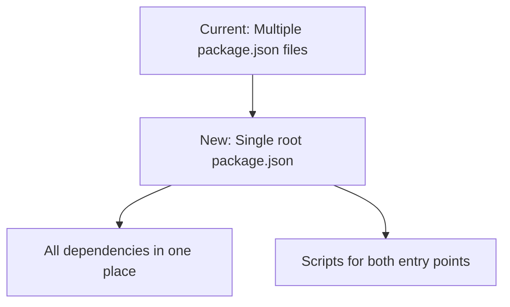
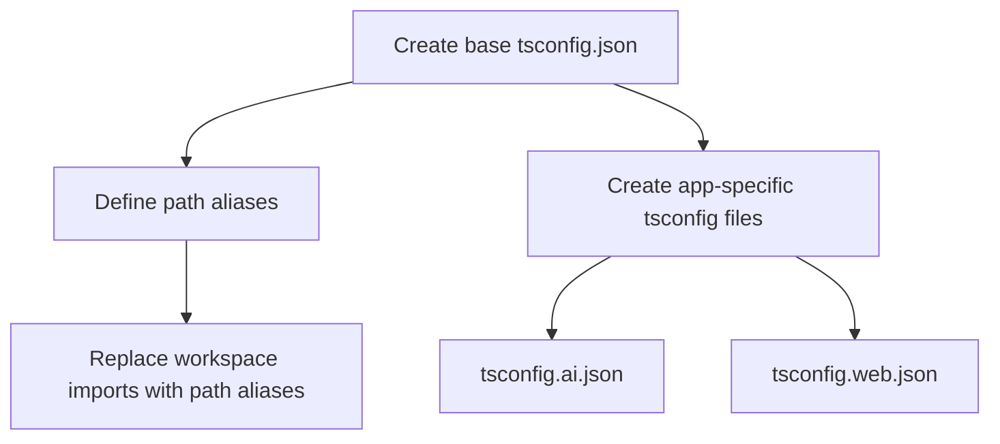
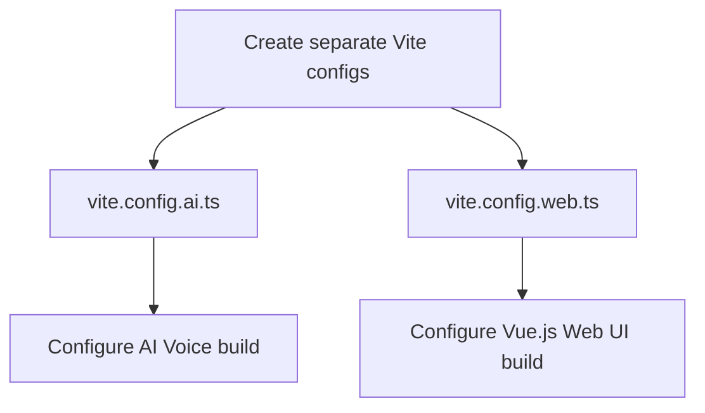
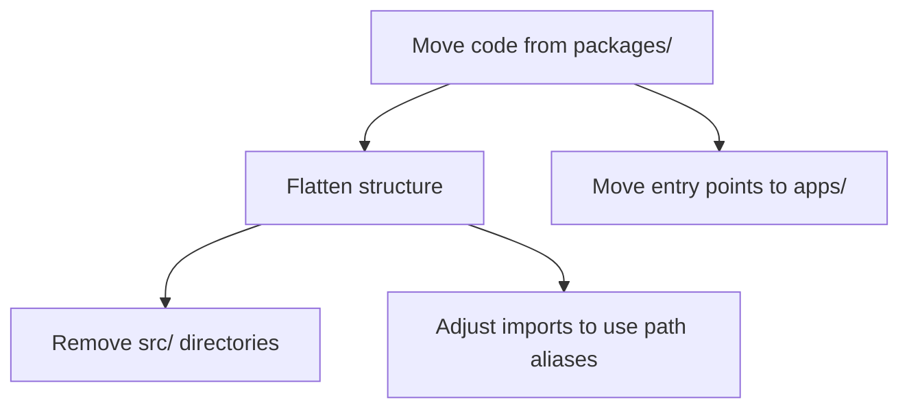
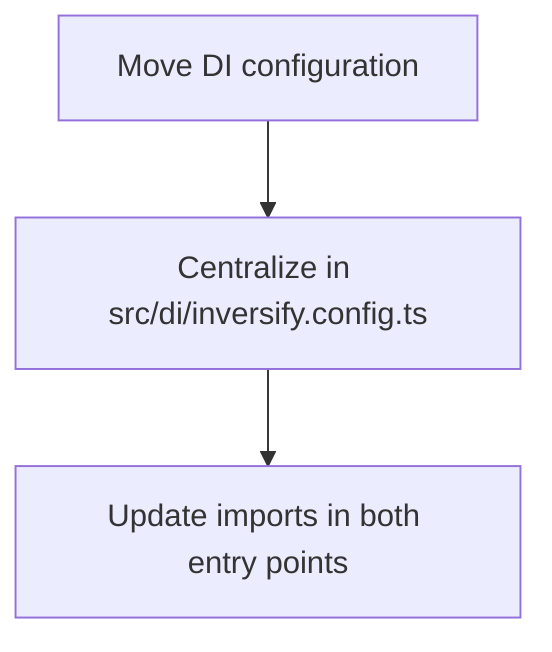

# Monorepo Restructuring Plan

Based on your feedback, I understand that you want to:

1. Maintain the current logical organization of code
2. Eliminate the need for multiple package.json and tsconfig.json files
3. Remove the requirement for src/ directories in each package
4. Keep the two entry points (AI Voice and Vue.js Web UI) with separate builds
5. Preserve the shared code that both entry points use

## Current Structure Analysis

Your current monorepo has:

- Multiple packages with their own package.json and tsconfig.json files
- A complex dependency management system using pnpm workspaces
- Two entry points (AI Voice and Vue.js Web UI)
- Shared code in /packages/shared and feature-specific view models

## Proposed New Structure

I propose a simplified structure that maintains the logical organization while eliminating the complexity of multiple packages:

```
note-vm-demo/
├── package.json (single root package.json)
├── tsconfig.json (base configuration)
├── tsconfig.ai.voice.json (extends base for AI Voice app)
├── tsconfig.web.vue.json (extends base for Web Vue app)
├── vite.config.ai.voice.ts (for AI Voice app)
├── vite.config.web.vue.ts (for Web Vue app)
├── src/ (all source code)
│   ├── apps/
│   │   ├── ai.voice/ (AI Voice entry point)
│   │   │   ├── index.html
│   │   │   ├── main.ts
│   │   │   ├── VoiceChat.ts
│   │   │   ├── style.css
│   │   │   └── ... (other AI Voice specific files)
│   │   └── web.vue/ (Vue.js Web UI entry point)
│   │       ├── index.html
│   │       ├── main.ts
│   │       ├── App.vue
│   │       ├── router/
│   │       └── ... (other Vue.js specific files)
│   ├── features/
│   │   ├── note/
│   │   │   ├── view-models/
│   │   │   │   ├── index.ts
│   │   │   │   ├── impl/
│   │   │   │   └── interfaces/
│   │   │   ├── views.ai.voice/
│   │   │   │   ├── index.ts
│   │   │   │   └── pages/
│   │   │   └── views.web.vue/
│   │   │       ├── index.ts
│   │   │       ├── CreateNoteView/
│   │   │       └── ListNoteView/
│   │   ├── user/
│   │   │   └── ... (similar structure as note)
│   │   └── ... (other features)
│   ├── di/ (dependency injection at root level)
│   │   └── inversify.config.ts
│   └── shared/
│       ├── api/
│       ├── constants/
│       ├── event-aggregator/
│       ├── result/
│       └── view-models/
```

## Implementation Plan

Here's how we can implement this restructuring:

### 1. Create a Single Root Package.json



The root package.json will include:

- All dependencies from all current packages
- Scripts for building and running both entry points
- TypeScript path aliases for imports

### 2. Configure TypeScript Path Aliases



Use TypeScript path aliases to replace the current workspace imports:

```json
{
  "compilerOptions": {
    "baseUrl": ".",
    "paths": {
      "src/*": ["./src/*"]
    }
  }
}
```

### 3. Configure Vite for Multiple Entry Points



Create separate Vite configuration files for each entry point:

- vite.config.ai.voice.ts for the AI Voice app
- vite.config.web.vue.ts for the Vue.js Web UI

### 4. Migrate Code Structure



1. Move all code from packages/ to the new src/ directory structure
2. Flatten the structure by removing individual package src/ directories
3. Update imports to use the new path aliases
4. Move entry points to the src/apps/ directory

### 5. Update Dependency Injection Setup



Centralize the dependency injection configuration and update imports in both entry points.

## Benefits of the New Structure

1. **Simplified Dependency Management**: One package.json file with all dependencies
2. **Centralized src Directory**: All source code in one place with a clean structure
3. **Easier Navigation**: Maintain logical organization without the complexity
4. **Separate Builds**: Each entry point can be built independently
5. **Simplified Imports**: Use TypeScript path aliases instead of workspace references

## Migration Steps

1. Create the new directory structure with a src/ directory at the root
2. Set up the root package.json with all dependencies
3. Configure TypeScript with a single "src/\*" path alias
4. Create Vite configurations for both entry points (ai.voice.ts and web.vue.ts)
5. Migrate code from the old structure to the new one using CLI commands
6. Update imports to use the src/\* path alias
7. Test both entry points to ensure they build and run correctly

## Implementation Using CLI Commands

To implement this restructuring efficiently, we'll use CLI commands rather than manual rewriting. Here's an example of how we might approach this:

```bash
# 1. Create the new directory structure
mkdir -p src/apps/ai.voice src/apps/web.vue src/features src/shared src/di/inversify.config.ts

# 2. Move files from packages to the new structure
# Example for moving AI Voice app
cp -r packages/app/ai.voice/* src/apps/ai.voice/
# Remove src/ directory if it exists in the destination
find src -type d -name "src" -not -path "src" | xargs -I{} bash -c 'cp -r "{}/"* "$(dirname {})" && rm -rf "{}"'

# 3. Update imports using find and sed
find src -type f -name "*.ts" -o -name "*.vue" | xargs sed -i 's/from '\''features__/from '\''src\/features\//g'
find src -type f -name "*.ts" -o -name "*.vue" | xargs sed -i 's/from '\''shared__/from '\''src\/shared\//g'
find src -type f -name "*.ts" -o -name "*.vue" | xargs sed -i 's/from '\''di/from '\''src\/di/g'
```

Note: The actual implementation commands will need to be adjusted based on the specific structure and import patterns in your codebase. These are provided as examples of the approach we'll take.
